# UL Mod Buddy -- User Guide

This walks through what the app actually does once it's built its dataset
from your install. For getting it running in the first place, see the
[README](README.md).

This guide (and the app itself) assumes a desktop browser -- it hasn't
been tested on phones or tablets, and setup in particular relies on a
browser API mobile browsers largely don't support yet.

## Searching and filtering

Type in the search box to find any recipe, research topic, or workstation
by name. The filter chips (**All / Recipes / Research / Workstations /
Items**) narrow the list to just one kind of entry -- useful once a search
term matches a lot of different things.

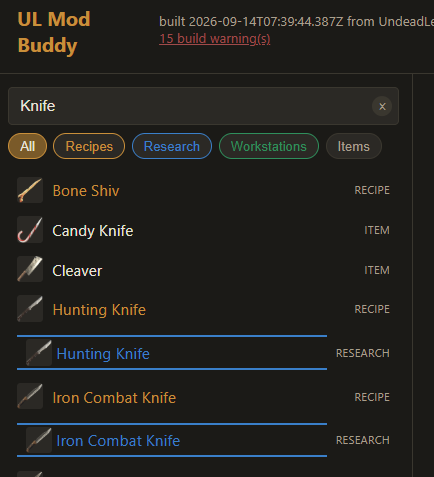

Note that the same item name can show up twice in results -- once as a
**Recipe** and once as **Research**. These are two different pages: the
recipe page is "what does it cost to build this," the research page is
"what does it cost to unlock the ability to build this." Click whichever
one you actually want.

## Item Detail Page

Selecting an item opens its detail page -- everything needed to make it,
all the way down to raw materials, in one place.

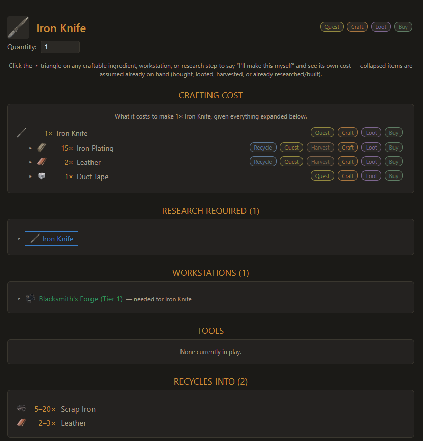

A few things worth knowing about this page:

- **The quantity box** at the top scales every number on the page --
  set it to 20 and every ingredient count updates to "what it costs to
  make 20 of these."
- **The chips next to every ingredient** (Craft / Loot / Buy / Harvest /
  Recycle / Quest) show every way that item can be obtained. Craft always
  means "look up its own recipe" -- the other chips are described below.

  

- **The ▶ triangle** next to any craftable ingredient, workstation, or
  research step expands it into its *own* cost tree. Left collapsed, an
  ingredient is assumed to already be in hand (bought, looted, harvested,
  or already built) -- expanding it says "no, I want to make this myself
  too," and its own ingredients get folded into the totals.
- **Research Required** shows the full research chain needed to unlock
  the recipe, including anything it cascades from. Here, the pistol
  round needs its own research, which itself needs an earlier research
  step first:

  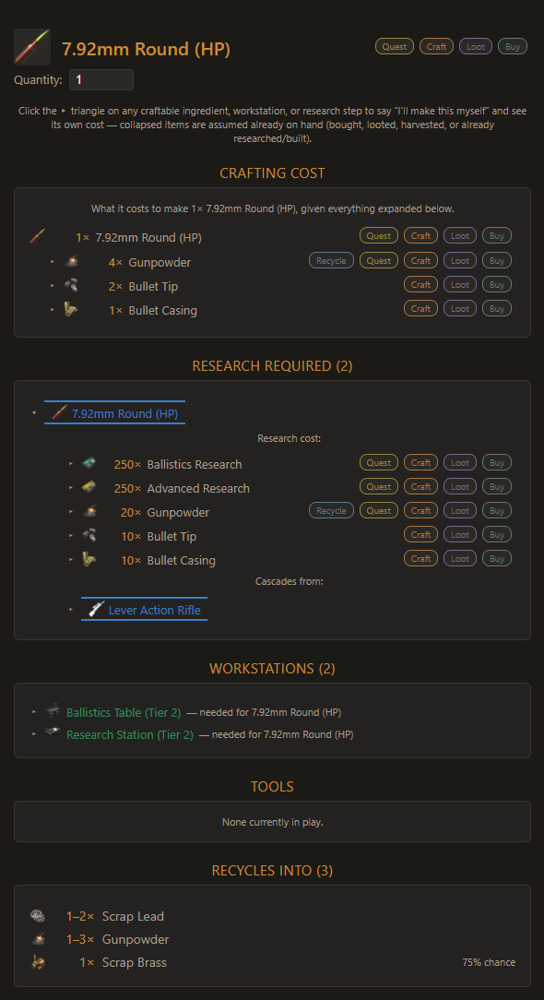

- **Recycles Into**, at the bottom, shows what you get back for breaking
  a copy of the item down at a Recycler.

### One-time totals

As you expand ingredients down through a few levels, a running
**One-Time Totals** panel keeps a flattened, deduplicated shopping list
of everything currently expanded -- so you don't have to add up the same
ingredient appearing under three different sub-trees by hand.

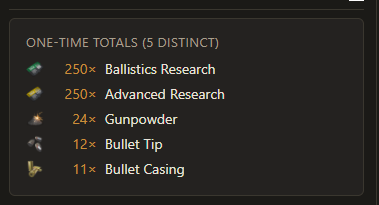

## Where to find things: Harvest and Recycle sources

Two of the chips shown next to an ingredient open a popup instead of
jumping to another page:

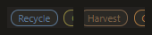

- **Harvest** -- every block/entity in the world that drops this item,
  with expected drop counts.
- **Recycle** -- every other item you could break down at a Recycler to
  get this one back as a yield.

Both are grouped into **High / Medium / Low yield** tiers, relative to
the best source for that specific item -- so the top of the list is
always where you should actually go looking first.

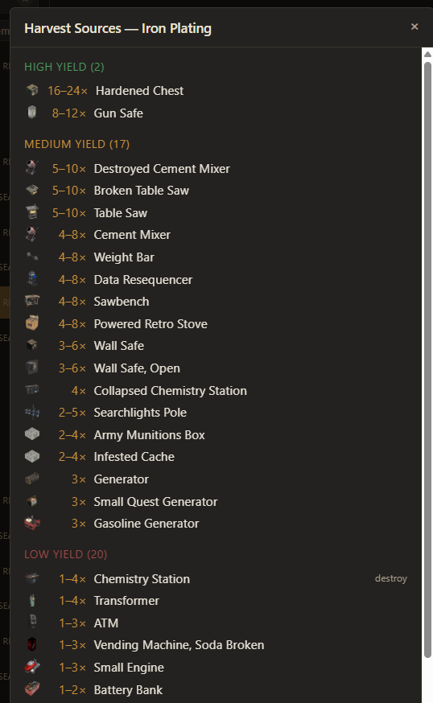

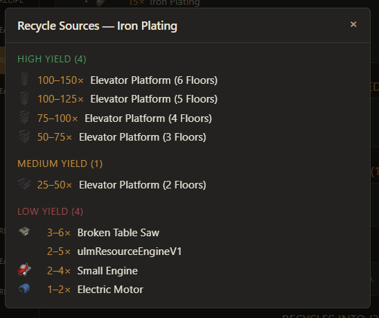

## The Research Tree

The **Research Tree** button (header, top right) opens a full visual map
of one research category at a time -- pick a category from the dropdown
to switch trees. Each node's ring color shows which Research Station tier
you need to conduct that specific research (see the legend at the top);
it's not related to the tier of whatever workstation the unlocked recipe
itself needs to craft with.

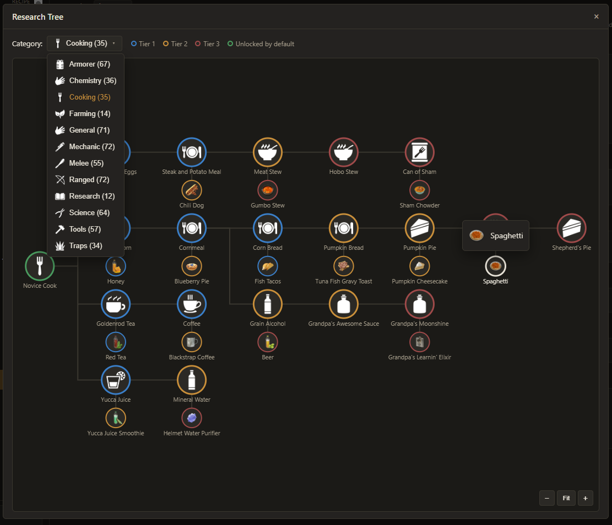

Getting around a tree bigger than the window:

- **Click-drag** anywhere on the canvas to pan around. Panning stops at
  the tree's own edges -- you can't drag it off into empty space forever.
- **Scroll wheel** zooms in/out, centered on wherever your cursor is.
- The **−** / **+** buttons in the corner zoom in fixed steps, centered
  on the middle of the view; **Fit** snaps back to the default
  zoomed-out overview of the whole category.
- **Clicking a node** jumps straight to that item/research's own detail
  page, same as clicking it in the search results.

## Vehicles

Selecting a vehicle's own recipe/item page shows its stats up top, plus
its full world-repair cost broken down by damage tier:

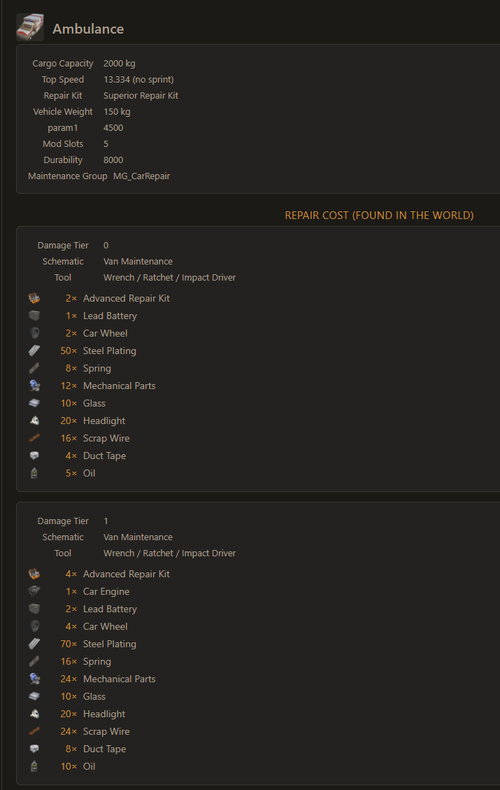

Below that, an **All Vehicles** table compares every vehicle's cargo
capacity, top speed, weight, mod slots, durability, and repair kit tier
side by side, grouped by vehicle class:

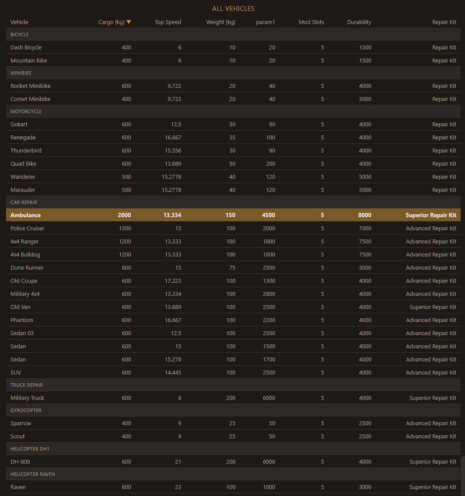

Click the column headers to re-sort by a different stat.

## Keeping the data current

If you've updated the mod, or reinstalled it to a new location, click
**Rebuild data** in the header to have the app pick that up. You get two
choices:

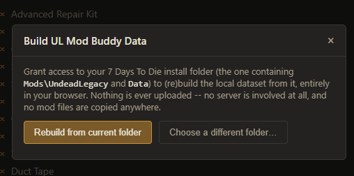

- **Rebuild from current folder** re-reads the same install folder you
  picked before (just re-confirming the browser's read permission --
  no need to click through the folder picker again).
- **Choose a different folder...** opens a fresh picker, for switching
  to a different install entirely (e.g. comparing a live install against
  a test/clone one).

The "built \<timestamp\> from UndeadLegacy X.Y.Z" line in the header shows
the mod's own declared version, per its `ModInfo.xml` -- the mod's author
doesn't always update that file on every release, so this number can lag
behind whatever version the game itself displays. Hover over the line for
a reminder of this.

## Build warnings

If you see an "N build warning(s)" link next to the header's summary
line, click it to see exactly what it found -- things like a likely typo
in the mod's own data, an item with no traceable unlock path, or a name
that had to be guessed from a related item because it has no
localization entry of its own. These are gaps or oddities in the mod's
own source data, surfaced for visibility -- never silently patched over.
